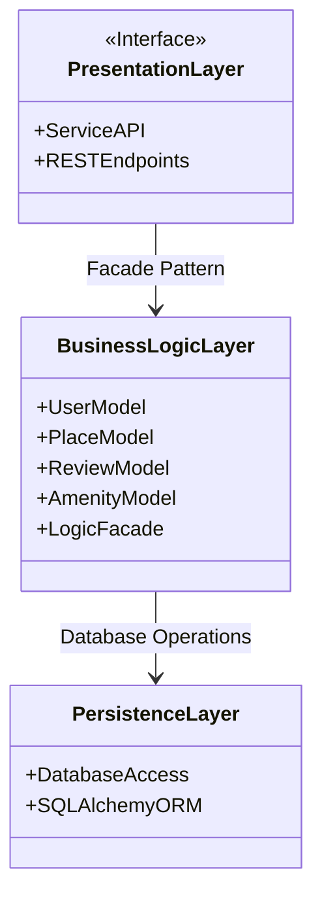
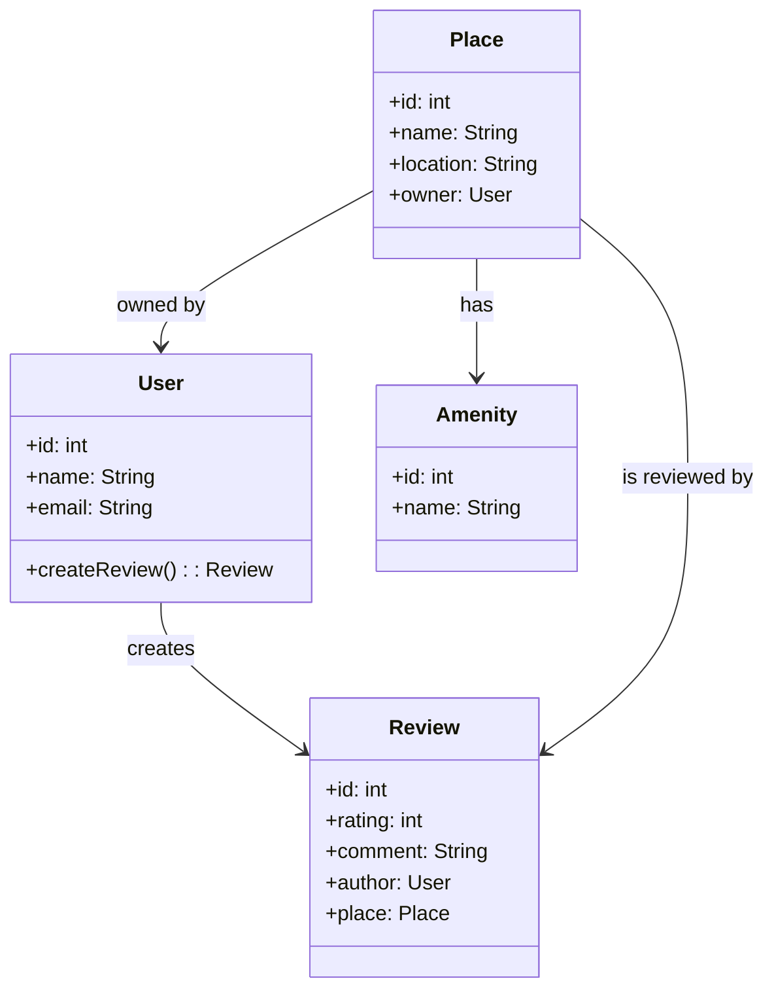
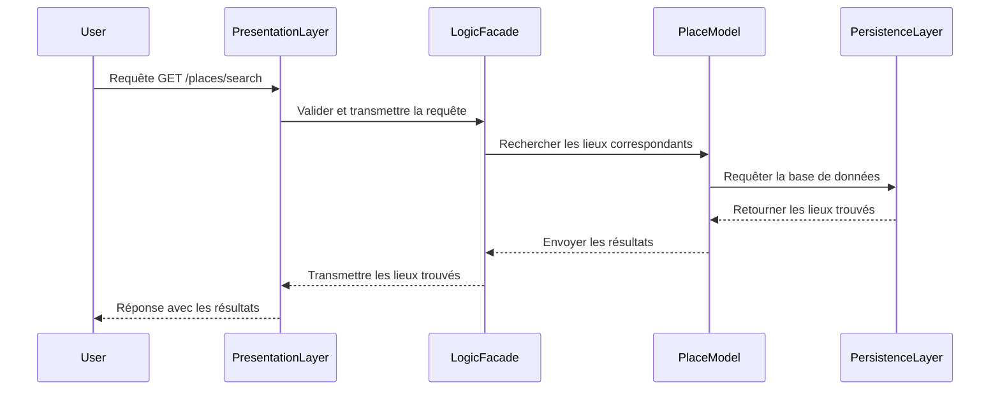

# HBnB Project - Technical Blueprint Document
## 1. Introduction
### Objectif du document :
Ce document technique décrit l'architecture du projet HBnB, fournissant une vue d'ensemble des différentes couches de l'application ainsi que des diagrammes détaillés pour guider les phases de mise en œuvre. Il servira de référence pour les développeurs tout au long du projet.

Présentation du projet HBnB :
HBnB est une plateforme de location de biens immobiliers à court terme, similaire à des services comme Airbnb. Ce document couvre l'architecture en couches utilisée pour structurer l'application et illustre les interactions entre ses différentes composantes.

## 2. Architecture de Haut Niveau
Diagramme de Paquetage (High-Level Package Diagram)
Voici un aperçu de l'architecture à trois couches de l'application HBnB, organisée selon le pattern Facade.
Ce diagramme montre les principales couches et leurs interactions.

### Explication :

### Couche de Présentation :
Elle gère les interactions avec les utilisateurs via des points de terminaison API (REST). Elle envoie les requêtes à la couche de logique métier via le Facade Pattern.
### Couche de Logique Métier :
Contient les modèles principaux et gère les règles métier du système.
### Couche de Persistance :
Interagit avec la base de données via un ORM comme SQLAlchemy pour stocker et récupérer les données.

## 3. Couche de Logique Métier
Diagramme de Classes (Class Diagram)
Ce diagramme illustre les entités principales utilisées dans la couche de logique métier ainsi que leurs relations.

### Explication :

User : Représente les utilisateurs de l'application. Chaque utilisateur peut laisser des avis (Review) sur des lieux (Place).
Place : Représente les lieux disponibles à la location. Un lieu a un propriétaire (User) et peut avoir plusieurs commodités (Amenity).
Review : Représente les avis laissés par les utilisateurs sur un lieu.
Amenity : Représente les commodités disponibles dans un lieu, par exemple, une piscine ou un accès Wi-Fi.

## 4. Flux d’Interaction API
Diagramme de Séquence pour l’Appel d’une API de Recherche de Lieux
Voici un exemple d'interaction pour une requête utilisateur cherchant des lieux à louer via l'API.

### Explication :

L'utilisateur envoie une requête de recherche de lieux via l'API.
La couche de présentation transmet cette requête à la couche de logique métier via le Facade.
Le modèle Place effectue la recherche en interrogeant la couche de persistance, qui accède à la base de données.
Les résultats sont renvoyés à l'utilisateur via la couche de présentation.

## 5. Notes Explicatives
Pourquoi utiliser une architecture en trois couches ?
L'architecture en trois couches permet de séparer clairement les responsabilités entre la présentation (interaction utilisateur), la logique métier (règles métier) et la persistance (accès aux données). Cela améliore la modularité, facilite les tests et rend l'application plus maintenable.

Rôle du Facade Pattern :
Le Facade simplifie les interactions entre la couche de présentation et la couche de logique métier. Il permet à la présentation de ne pas avoir à gérer les détails complexes de la logique métier, ce qui réduit les dépendances et facilite l'évolution du code.

Conclusion
Ce document technique fournit une vue complète de l'architecture de l'application HBnB. Il sert de guide de référence pour les développeurs pendant les phases d'implémentation, en s'assurant que la structure du projet respecte les principes de modularité, de réutilisabilité et de maintenabilité.

Format Final
Ce document peut être sauvegardé en PDF pour être distribué aux membres de l'équipe de développement et pour servir de base tout au long du projet.

