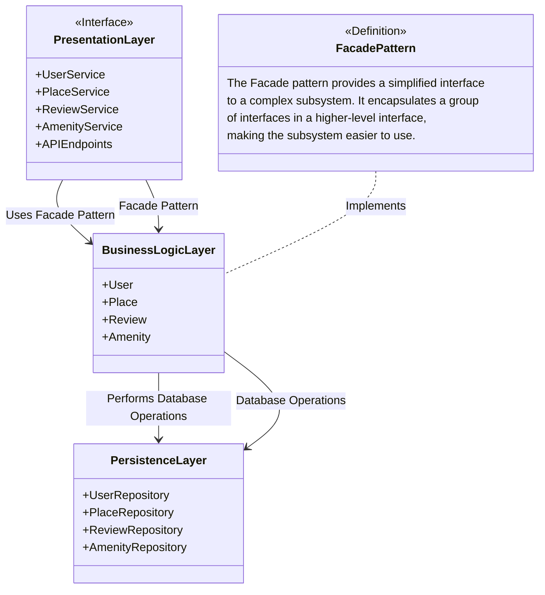
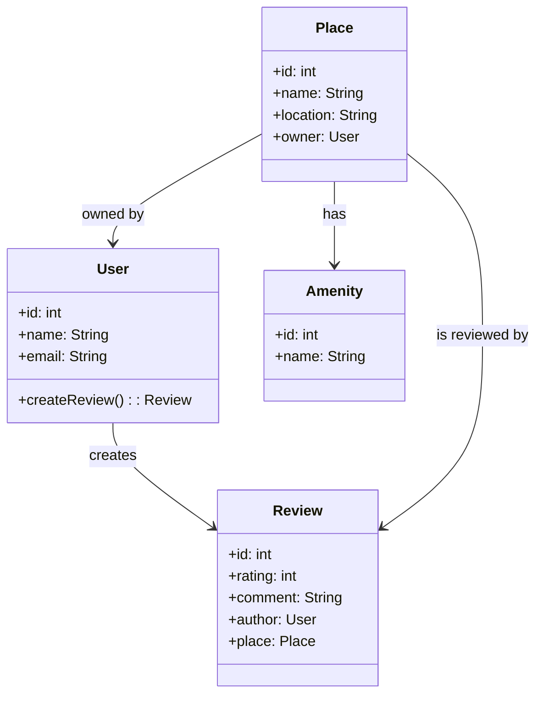
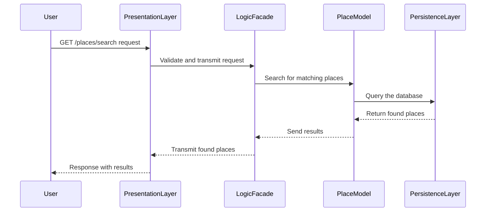

# HBnB Project - Technical Blueprint Document

## 1. Introduction

### Document Objective:
This technical document describes the architecture of the HBnB project, providing an overview of the different layers of the application as well as detailed diagrams to guide the implementation phases. It will serve as a reference for developers throughout the project.

### HBnB Project Overview:
HBnB is a short-term property rental platform, similar to services like Airbnb. This document covers the layered architecture used to structure the application and illustrates the interactions between its various components.

## 2. High-Level Architecture

### Package Diagram (High-Level Package Diagram)
Here's an overview of the three-layer architecture of the HBnB application, organized according to the Facade pattern.
This diagram shows the main layers and their interactions.

### Explanation:

#### Presentation Layer:
Handles user interactions via API endpoints (REST). It sends requests to the business logic layer via the Facade Pattern.

#### Business Logic Layer:
Contains the main models and manages the system's business rules.

#### Persistence Layer:
Interacts with the database via an ORM like SQLAlchemy to store and retrieve data.

## 3. Business Logic Layer

### Class Diagram
This diagram illustrates the main entities used in the business logic layer and their relationships.

### Explanation:

User: Represents the application users. Each user can leave reviews (Review) on places (Place).
Place: Represents the locations available for rent. A place has an owner (User) and can have multiple amenities (Amenity).
Review: Represents the reviews left by users on a place.
Amenity: Represents the amenities available in a place, for example, a swimming pool or Wi-Fi access.

## 4. API Interaction Flow

### Sequence Diagram for a Place Search API Call
Here's an example of interaction for a user request searching for places to rent via the API.

### Explanation:

1. The user sends a place search request via the API.
2. The presentation layer transmits this request to the business logic layer via the Facade.
3. The Place model performs the search by querying the persistence layer, which accesses the database.
4. The results are sent back to the user via the presentation layer.

## 5. Explanatory Notes

### Why use a three-layer architecture?
The three-layer architecture allows for a clear separation of responsibilities between presentation (user interaction), business logic (business rules), and persistence (data access). This improves modularity, facilitates testing, and makes the application more maintainable.

### Role of the Facade Pattern:
The Facade simplifies interactions between the presentation layer and the business logic layer. It allows the presentation to not have to manage the complex details of the business logic, which reduces dependencies and facilitates code evolution.

## Conclusion

This technical document provides a comprehensive view of the HBnB application architecture. It serves as a reference guide for developers during the implementation phases, ensuring that the project structure adheres to the principles of modularity, reusability, and maintainability.

## Final Format

This document can be saved as a PDF to be distributed to development team members and to serve as a basis throughout the project.
