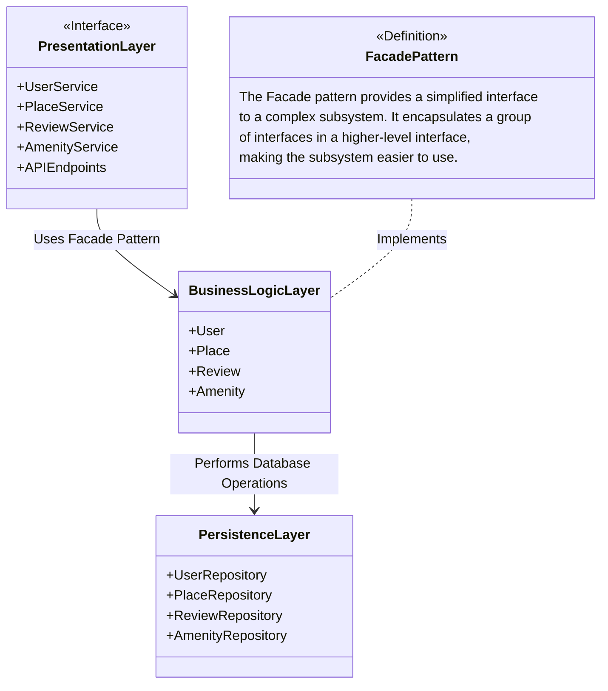
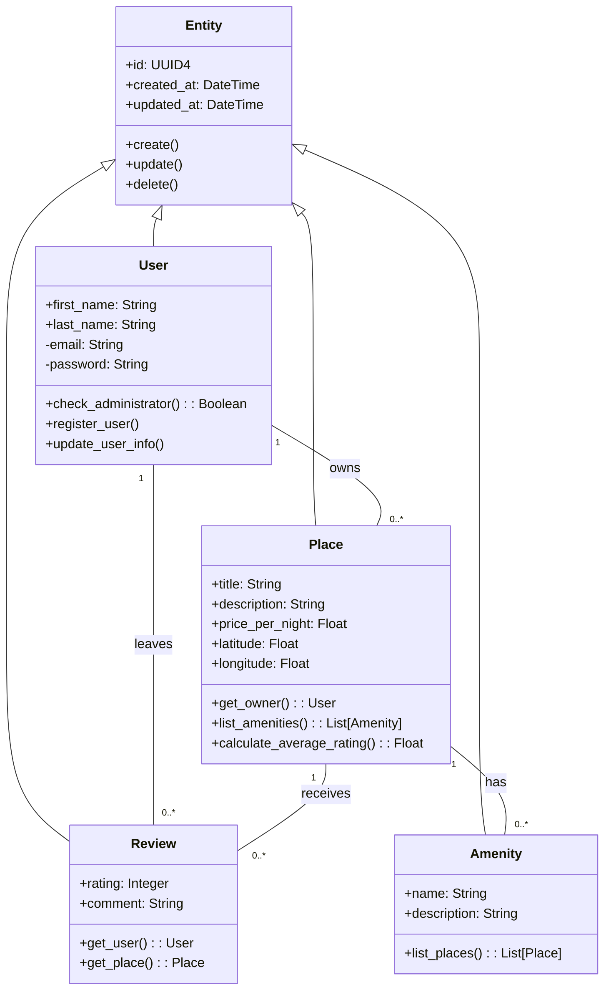
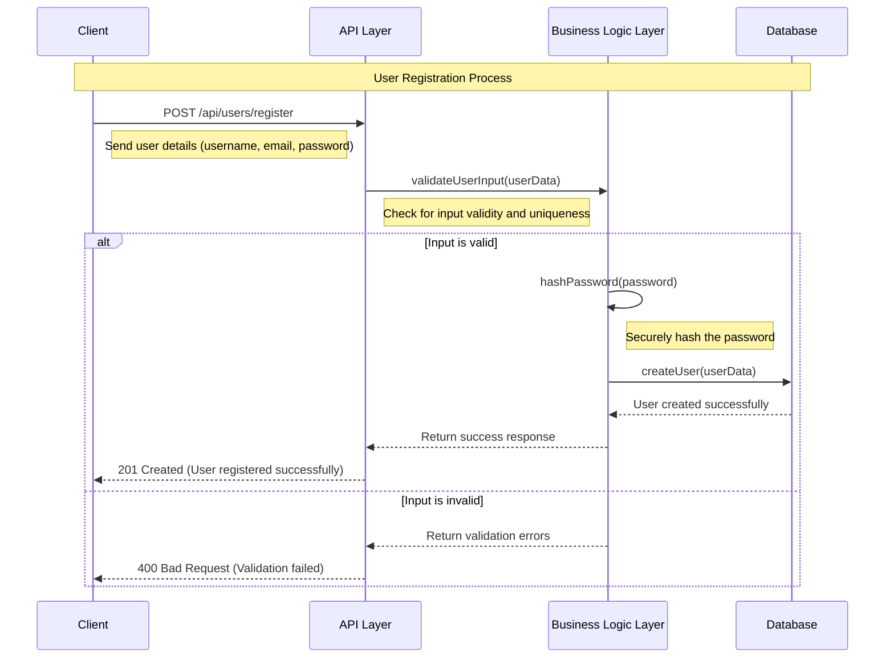

# __HBnB Project - Technical Blueprint Document__

## Introduction

### Document Objective:
This technical document describes the architecture of the HBnB project, providing an overview of the different layers of the application as well as detailed diagrams to guide the implementation phases. It will serve as a reference for developers throughout the project.

### HBnB Project Overview:
HBnB is a short-term property rental platform, similar to services like Airbnb. This document covers the layered architecture used to structure the application and illustrates the interactions between its various components.

## 1. High-Level Package Diagram

### Explanation
This diagram illustrates the overall architecture of the HBnB application using a three-layer structure:

1. **Presentation Layer**: 
   - Interfaces with users through services (UserService, PlaceService, ReviewService, AmenityService) and API endpoints.
   - Acts as the entry point for user interactions.

2. **Business Logic Layer**:
   - Contains core entities (User, Place, Review, Amenity).
   - Implements business rules and processes data.

3. **Persistence Layer**:
   - Manages data storage through repositories (UserRepository, PlaceRepository, ReviewRepository, AmenityRepository).
   - Handles database operations for each entity.

__Key Features:__
- The Presentation Layer interacts with the Business Logic Layer using the Facade Pattern, simplifying access to complex business services.
- The Business Logic Layer performs database operations through the Persistence Layer.
- The Facade Pattern is implemented in the Business Logic Layer, providing a unified interface to the subsystem.

## 2. Business Logic Layer Class Diagram

### Explanation
This diagram details the structure of the Business Logic Layer:

1. **Entity** (Base Class):
   - Common attributes: id (UUID4), created_at, updated_at.
   - Common methods: create(), update(), delete().

2. **User**, **Place**, **Review**, **Amenity**:
   - Inherit from Entity.
   - Specific attributes and methods for each entity.

__Relationships:__
- A User can own multiple Places (0..*) and leave multiple Reviews (0..*).
- A Place can have multiple Amenities (0..*) and receive multiple Reviews (0..*).

This structure encapsulates the core business logic and data model of the HBnB application, showing how different entities relate to each other and what operations they can perform.

## 3. API Interaction Flow (Sequence Diagram)

### Explanation
This diagram illustrates the user registration process, showing the interaction between different components of the system:

1. **Client** initiates the process by sending a POST request to /api/users/register with user details.

2. **API Layer** receives the request and forwards it to the Business Logic Layer for validation.

3. **Business Logic Layer**:
   - Validates the user input.
   - If valid, it hashes the password for security.
   - Attempts to create the user in the database.

4. **Database** creates the user and confirms the operation.

5. **Response Flow**:
   - If successful, a 201 Created response is sent back to the client.
   - If validation fails, a 400 Bad Request response is returned.

__Additional Notes:__
1. Error handling is included at each step.
2. Rate limiting is recommended to prevent abuse.
3. An email verification step could be added for enhanced security.

This diagram provides a clear visualization of the user registration process, showing how data flows through the system and how different layers interact to complete the operation.
## __Conclusion__

This technical document provides a comprehensive view of the HBnB application architecture. It serves as a reference guide for developers during the implementation phases, ensuring that the project structure adheres to the principles of modularity, reusability, and maintainability.

# System Architecture Overview

```mermaid
%%{init: {'theme': 'dark'}}%%
graph LR
    Client[Client]
    API["API Endpoints"]
    Services["Services"]
    Entities["Entities"]
    BusinessRules["Business Rules"]
    Repositories["Repositories"]
    Database[(Database)]

    subgraph PresentationLayer["Presentation Layer"]
        API
        Services
    end

    subgraph BusinessLogicLayer["Business Logic Layer"]
        Entities
        BusinessRules
    end

    subgraph PersistenceLayer["Persistence Layer"]
        Repositories
    end

    Client -->|Request| API
    API --> Services
    Services -->|Use| Entities
    Entities -->|Apply| BusinessRules
    Entities -->|CRUD| Repositories
    Repositories -->|Query| Database
    Database -->|Data| Repositories
    Repositories -->|Result| Entities
    Entities -->|Response| Services
    Services -->|Response| API
    API -->|Response| Client

    classDef default fill:#000,stroke:#fff,stroke-width:2px;
    classDef layer fill:#333,stroke:#fff,stroke-width:2px;

    class PresentationLayer,BusinessLogicLayer,PersistenceLayer layer;
    
    class Client,API,Services,Entities,BusinessRules,Repositories default;
```

This document provides a quick overview of the system architecture process illustrated in the diagram.

## Architecture Layers

### 1. Presentation Layer
- **Components**: 
  - **API Endpoints**: Receives client requests.
  - **Services**: Orchestrates flow between API and business logic.

- **Process**:
  - Client sends a request to the API.
  - API forwards the request to Services.

### 2. Business Logic Layer
- **Components**: 
  - **Entities**: Core data structures.
  - **Business Rules**: Applies logic to Entities.

- **Process**:
  - Services use Entities for operations.
  - Business Rules ensure compliance.
  - Entities interact with Repositories for CRUD operations.

### 3. Persistence Layer
- **Components**: 
  - **Repositories**: Manages data access and manipulation.

- **Process**:
  - Entities perform CRUD via Repositories.
  - Repositories query the Database.
  - Database responds with data.

## Request/Response Flow

1. Client → API (Request)
2. API → Services
3. Services → Entities
4. Entities → Repositories (CRUD)
5. Repositories → Database (Query)
6. Database → Repositories (Data)
7. Repositories → Entities (Result)
8. Entities → Services (Response)
9. Services → API
10. API → Client (Response)

## Conclusion

This architecture ensures a clear separation of concerns, facilitating easier maintenance and scalability. Understanding this flow is essential for effective development and data management within the application.

## Final Format

``This document can be saved as a PDF to be distributed to development team members and to serve as a basis throughout the project.``
